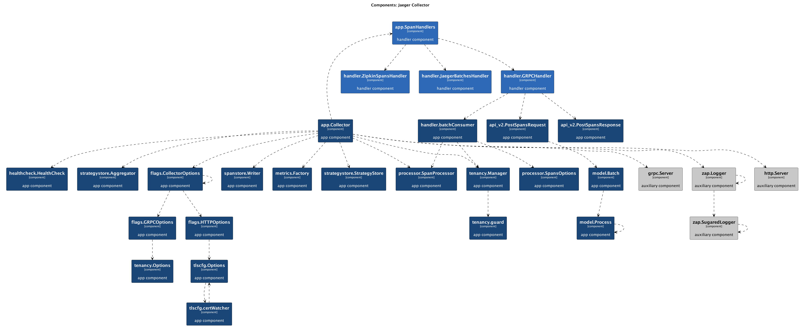

[](https://github.com/krzysztofreczek/go-structurizr/actions/workflows/ci.yml)
[](https://opensource.org/licenses/MIT)

# go-structurizr

This library allows you to auto-generate C4 component diagrams from Go code.



## Usage and Examples

To quickly learn how to use the library, check out my [blog post](https://threedots.tech/post/auto-generated-c4-architecture-diagrams-in-go/) for a step-by-step implementation guide.

You can also find several examples in the `cmd` directory. To run any of these examples, use the provided shell script.

## How It Works

The library provides tools (Scraper and View) to scrape and render Go structures into a [C4 component](https://c4model.com/) diagram in [PlantUML](https://plantuml.com/) format.

- **Scraper** reflects a given structure according to interfaces, predefined rules, and configurations.
- You can pass the scraped structure into a **View** definition, which can then be rendered into PlantUML diagram code.

Scraper identifies components to scrape under the following conditions:
- The type being examined implements the `model.HasInfo` interface.
- The type being examined matches one of the rules registered with the scraper.

## Components

### Component Info

The `model.Info` structure defines a component in the scraped structure of your code:

```go
type Info struct {
	Kind        string      // kind of scraped component
	Name        string      // component name
	Description string      // component description
	Technology  string      // technology used within the component
	Tags        []string    // tags used to match view styles to component
}
```

### Scraper

You can instantiate the scraper in one of two ways:
- From the code
- From a YAML file

To instantiate the scraper, provide a configuration that includes the prefixes of packages you want to reflect. Types that do not match any of the specified prefixes will not be processed.

```go
config := scraper.NewConfiguration(
    "github.com/org/pkg",
)
s := scraper.NewScraper(config)
```

After creating a scraper instance, you can register rules that will allow it to identify components to include in the output structure.

Each rule consists of:
- A set of package regular expressions: Only types in a package matching at least one of the regular expressions will be processed.
- A name regular expression: Only types whose names match the regular expression will be processed.
- An apply function: A function that produces `model.Info` describing the component to include in the scraped structure.

```go
r, err := scraper.NewRule().
    WithPkgRegexps("github.com/org/pkg/foo/.*").
    WithNameRegexp("^.*Client$").
    WithApplyFunc(
        func(name string, _ ...string) model.Info {
            return model.ComponentInfo(name, "foo client", "gRPC", "TAG")
        }).
    Build()
err = s.RegisterRule(r)
```

The apply function has two arguments: the name and groups matched from the name regular expression.

Example:
```go
r, err := scraper.NewRule().
    WithPkgRegexps("github.com/org/pkg/foo/.*").
    WithNameRegexp(`^(\w*)\.(\w*)Client$`).
    WithApplyFunc(
        func(_ string, groups ...string) model.Info {
            // Perform checks on the groups, then:
            n := fmt.Sprintf("Client of external %s service", groups[1])
            return model.ComponentInfo(n, "foo client", "gRPC", "TAG")
        }).
    Build()
err = s.RegisterRule(r)
```

Alternatively, you can instantiate the scraper from a YAML configuration file:

```yaml
# go-structurizr.yml
configuration:
  pkgs:
    - "github.com/org/pkg"

rules:
  - name_regexp: "^.*Client$"
    pkg_regexps:
      - "github.com/org/pkg/foo/.*"
    component:
      description: "foo client"
      technology: "gRPC"
      tags:
        - TAG
```

You can also use regular expression groups in YAML rule definitions:

```yaml
rules:
  - name_regexp: "(\\w*)\\.(\\w*)Client$"
    pkg_regexps:
      - "github.com/org/pkg/foo/.*"
    component:
      name: "Client of external {1} service"
      description: "foo client"
      technology: "gRPC"
      tags:
        - TAG
```

To create a scraper from the configuration file:

```go
s, err := scraper.NewScraperFromConfigFile("./go-structurizr.yml")
```

Once the scraper is instantiated and configured, you can use it to scrape any structure. The scraper returns a `model.Structure`.

```go
structure := s.Scrape(app)
```

### View

Similarly to the scraper, a view can be instantiated in one of two ways:
- From the code
- From a YAML file

To render a scraped structure, you need to instantiate and configure a view. A view consists of:
- Title
- Component styles: Styles are applied to components by matching the first component tag with style IDs.
- Additional styling (e.g., line color)
- Component tags: If specified, the view will only contain components tagged with one of the view tags. If no tags are defined, all components will be included.
- Root component tags: If specified, the view will only include components that have a direct or indirect connection to at least one component with a root tag.

To instantiate a default view, use the view builder:

```go
v := view.NewView().Build()
```

To customize it, use the available builder methods:

```go
v := view.NewView().
    WithTitle("Title").
    WithComponentStyle(
        view.NewComponentStyle("TAG").
            WithBackgroundColor(color.White).
            WithFontColor(color.Black).
            WithBorderColor(color.Black).
            WithShape("database").
            Build(),
    ).
    WithComponentTag("TAG").
    WithRootComponentTag("ROOT").
    Build()
```

Alternatively, you can instantiate the view from a YAML configuration file:

```yaml
# go-structurizr.yml
view:
  title: "Title"
  line_color: 000000ff
  styles:
    - id: TAG
      background_color: ffffffff
      font_color: 000000ff
      border_color: 000000ff
      shape: database
  root_component_tags:
    - ROOT
  component_tags:
    - TAG
```

To create a view from the configuration file:

```go
v, err := view.NewViewFromConfigFile("./go-structurizr.yml")
```

Once the view is initialized, you can render the structure into a PlantUML diagram:

```go
outFile, _ := os.Create("c4.plantuml")
defer func() {
    _ = outFile.Close()
}()

err = v.RenderStructureTo(structure, outFile)
```

## Debug Mode

To enable detailed scraping or view rendering logs, set the `LOG_LEVEL` environment variable to `debug` or `DEBUG`.

## Best Practices

For the best results and experience with the library, follow these practices:
- Use a solid, well-organized application context following clean architecture principles. This makes your diagrams simpler and easier to read and allows for a shorter list of component types and styles.
- Maintain consistent naming conventions to simplify and clarify scraper rules.

## Full Code Documentation

For full code documentation, visit [pkg.go.dev](https://pkg.go.dev/github.com/krzysztofreczek/go-structurizr).
